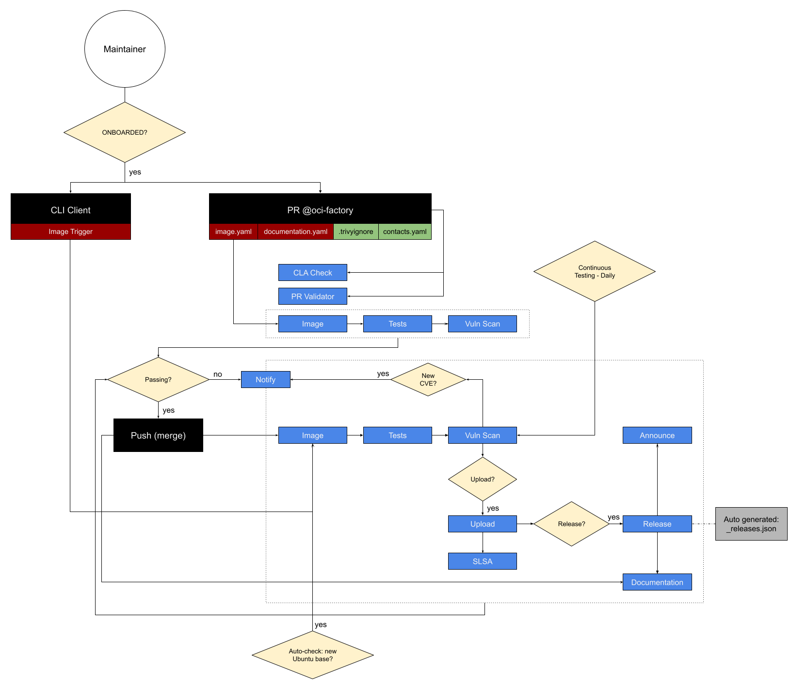

<div align="center">

# Welcome to the OCI Factory! 👋

*Behind every great rock is a great quarry...*
</div>

## Index
- [Welcome to the OCI Factory! 👋](#welcome-to-the-oci-factory-)
  - [Index](#index)
  - [🍿 **Before you get started**](#-before-you-get-started)
    - [What is the OCI Factory?](#what-is-the-oci-factory)
    - [Why does it exist?](#why-does-it-exist)
    - [Who is it for?](#who-is-it-for)
    - [How to qualify as a Maintainer?](#how-to-qualify-as-a-maintainer)
  - [🌈 **How to contribute**](#-how-to-contribute)
    - [As a developer](#as-a-developer)
    - [As a **Maintainer** ⛏ 🪨](#as-a-maintainer--)
      - [1. With Pull Requests](#1-with-pull-requests)
      - [2. With the CLI Client](#2-with-the-cli-client)
  - [🗃 **Maintainer files**](#-maintainer-files)
    - [Trigger files](#trigger-files)
      - [Image trigger file](#image-trigger-file)
        - [Example: *image.yaml*](#example-imageyaml)
      - [Documentation trigger file](#documentation-trigger-file)
        - [Example: *documentation.yaml*](#example-documentationyaml)
    - [Other files](#other-files)
      - [Contacts](#contacts)
        - [Example: *contacts.yaml*](#example-contactsyaml)
      - [Vulnerability Filtering](#vulnerability-filtering)
        - [Example: *.trivyignore*](#example-trivyignore)
  - [📦 Reusable workflows](#-reusable-workflows)
    - [Build-Rock Workflow](#build-rock-workflow)
    - [Test-Rock Workflow](#test-rock-workflow)


## 🍿 **Before you get started**

If you are planning on contributing to this repository, you **must** first
have a look at the [CONTRIBUTING](/CONTRIBUTING.md) guidelines.

Plus, if you're still trying to figure out the "whats" and "whys" of this
repository, then here's a TL;DR for you.

### What is the OCI Factory?

This repository is a centralized “gateway” for all Ubuntu OCI images in
Docker Hub, ECR, and any other container registry where we have the ROCKS
Team-maintained "ubuntu" namespace (eg. `docker.io/ubuntu/<image-name>`
or `public.ecr.aws/ubuntu/<image-name>`).

### Why does it exist?

In order to provide best-in-class Ubuntu-based container images, we need to
have:

- image governance framework: a standardized quality assurance process for all
container images in the "ubuntu" namespace, such that they are subject to the
same build, test release and documentation processes,
- access regulation: whilst images can be built by anyone, the "ubuntu"
namespace is maintained by the ROCKS Team, which must act as a gatekeeper to
prevent the proliferation of credentials,
- automated lifecycle maintenance: we need to ensure that the images in the
"ubuntu" namespace are always up to date and offer a transparent view of their
provenance, constitution and vulnerability exposure. For that, we need a
robust set of automated workflows to carry out the necessary auditing
subsequent and lifecycle maintenance jobs for every published image.

### Who is it for?

**Maintainers** of Ubuntu Rocks and Ubuntu-based OCI images.

### How to qualify as a Maintainer?

You have (or want to have) 1 or more image(s) in the "ubuntu" namespace (i.e.
in Docker Hub, or ECR, etc.).

There is <u>an exception</u> where a **Maintainer** might not necessarily be
building images to be released into the "ubuntu" namespace, but rather to be
used in other Canonical-driven workflows (eg. for Charms). These cases need to
be assessed on an individual basis, and for that, you should reach out to the
ROCKS Team (directly, via an
[issue](https://github.com/canonical/oci-factory/issues), or via
<rocks@canonical.com>).

NOTE: all Maintainers must abide by the [Image Maintainer
Agreement](/IMAGE_MAINTAINER_AGREEMENT.md).

## 🌈 **How to contribute**

### As a developer

If you are **not** an Image Maintainer, you can still help the ROCKS Team
by suggesting improvements and/or features to this repository's code base.

Just make sure you read the [CONTRIBUTING](/CONTRIBUTING.md) guidelines
(excluding the Maintainer Agreement), and you'll be set to start making
Pull Requests 🚀.

### As a **Maintainer** ⛏ 🪨

Maintainers can request new image builds and releases by either creating
Pull Requests (PRs) or via the OCI Factory CLI Client.

#### 1. With Pull Requests

Maintainers can use Pull Requests (PRs) as an interface for asking the OCI
Factory to build their images. Here's what you should do and know before you
make your first PR as a Maintainer:

1. you must follow the [CONTRIBUTING](/CONTRIBUTING.md) guidelines;
   - that includes abiding by the
[Image Maintainer Agreement](/IMAGE_MAINTAINER_AGREEMENT.md);
2. before making your first PR, you **must** [request the onboarding of a new image](https://github.com/canonical/oci-factory/issues/new/choose);
3. each PR **must** only target one OCI image, i.e. you can ask the OCI Factory
to build multiple versions of the same image with a single PR, but **not**
multiple images;
   - that means one PR can only propose changes to
[Maintainer files](#maintainer-files) within a single `oci` folder.

#### 2. With the CLI Client

Maintainers can use the OCI Factory's CLI Client to interact with the OCI
Factory. The CLI Client is a Go module at [tools/cli-client](tools/cli-client).

Here's what you should do and know before you use the CLI Client:

1. you **must** already be an onboarded Maintainer and have had significant
interactions with the OCI Factory (via PRs). Why is that? To use this client
you'll be granted write permissions to the repository, and thus you'll have
escalated rights when compared to a regular Maintainer - with great power
comes great maintainability,
2. each use of the CLI Client **must** only target one version of an OCI image,
i.e. you can ask the OCI Factory to build one version of the image, upload and
release it to GHCR, Docker Hub, and ECR with different tracks, risks and EOL with
a single command, but **not** multiple versions of the same image.

Further documentation regarding the CLI Client can be found [here](tools/cli-client/README.md).

Refer to the diagram below to understand the oci-factory workflow:



## 🗃 **Maintainer files**

As a Maintainer, you'll be associated with one or more `oci` folders within
this repository.

An `oci` folder name **must match the OCI image's name in the registry** (i.e.
the field “name” in the `rockcraft.yaml` file). Also, each `oci` folder will
host the Maintainer files upon which the OCI Factory will rely to understand:

- what image to build;
- what metadata to rely on (like the developer’s contact information);
- how to tag and release the OCI image;
- whether to release an existing revision;
- if an existing image should be deprecated.

Here's an example of how an `oci` folder would look for your image:

```console
oci/my-oci-image/
├── contacts.yaml
├── documentation.yaml
├── _releases.json (on branch `_releases`)
└── image.yaml
```

Read the following sections to understand which of these files are
[Trigger files](#trigger-files) and which ones aren't

### Trigger files

Since PRs will be used as the interface for Maintainers to interact with the
OCI Factory, the goal of the Trigger files is to provide the necessary mechanisms and syntax to make the Maintainer's experience as familiar and
aligned as possible with already existing Craft commands such as `pack`,
`upload` and `release`.

#### Image trigger file

The `image.yaml` file will trigger builds and releases for a given OCI image.
This file's schema depicts the following workflow:

- the same OCI image can be built for multiple versions and bases,
- each build will result in a new image artefact,
- each image artefact is uploaded to GHCR as a new image **revision**,
- an image revision can be released into one or more channels,
  - channels translate into OCI tags,
- if released, an image is then published to Docker Hub and ECR.

Having said that this trigger's syntax is as follows:

| Property | Required | Type | Description |
|---|---|---|---|
| version | True | int | The file schema's version for allowing future schema modification without regressions. |
| release | False | Dict[Dict[str, Any]] | Release **existing** image revisions to channels. Equivalent to `rockcraft release <revision> <channels>`. |
| release.\<track\> | True | Dict[str, Any] | Track to be updated |
| release.\<track\>.end-of-life | True* | str | Date (ISO8601) after which the build system will stop the automatic updates (i.e. EOL). </br></br> *this field is only required when opening the `<track>` for the 1st time. |
| release.\<track\>.stable | False | str | Risks to be updated. Can point to a revision or another channel. |
| release.\<track\>.candidate | False | str | Risks to be updated. Can point to a revision or another channel. |
| release.\<track\>.beta | False | str | Risks to be updated. Can point to a revision or another channel. |
| release.\<track\>.edge | False | str | Risks to be updated. Can point to a revision or another channel. |
| upload | False | conlist[Dict[str, Any], min_items=1] | List of image builds. Equivalent to `rockcraft pack && rockcraft upload` |
| upload[*].source | True | str | Git repository hosting the image's project. |
| upload[*].commit | True | str | Specific reference in the source, where to run the build from. |
| upload[*].directory | True | str | Path to the "rockcraft.yaml". Where the build will run from. |
| upload[*].ignored-vulnerabilities | False | conlist[str, unique_items=true] | List of vulnerability IDs (CVE or GHSA) to ignore during vulnerability scanning. These IDs will be added to the image's build metadata for future reference. When specifying this field, the `.trivyignore` file will be ignored. |
| upload[*].release | False | Dict[Dict[str, Any]] | Immediately release this (yet unknown) revision to the given channels. Same as using `--release <channels>` with `rockcraft upload`. |
| upload[*].release.\<track\> | True | Dict[str, Any] | Track to release this revision to. Canonical track `<version>-<base>` MUST be explicit, always! |
| upload[*].release.\<track\>.end-of-life | True* | str | Same as `release.<track>` above. |
| upload[*].release.\<track\>.risks | True | conlist[str, unique_items=true, min_items=1] | Risks to release to. If undefined, higher risks will always follow the next lower risk. The risks must be one of "edge", "beta", "candidate", "stable" |

##### Example: *image.yaml*

```yaml
version: 1

release:
  1:
    end-of-life: "2027-05-01"
    candidate: 23               # image revision number 23
    edge: "1.2-22.04_edge"      # follow whatever revision is in that channel

upload:
 - source: canonical/foo-bar
   commit: 24125d66dd60288fd2a0d68eb0e368ca384fcdcd
   directory: .
   release:
     1.2-22.04:
       end-of-life: "2024-05-01T00:00:00Z"
       risks:
         - edge
```

#### Documentation trigger file

The `documentation.yaml` file is the Documentation trigger file.

Registry documentation is always updated upon an image release, based on the
existing documentation trigger file, at the time of release.
Additionally, if the documentation trigger is modified, the registry
documentation will also be updated for the already published OCI image.

This trigger file's syntax is inspired by the already existing [documentation
mechanisms](https://code.launchpad.net/~ubuntu-docker-images/ubuntu-docker-images/+git/templates/+ref/main)
for the "ubuntu" namespace, as is as follows:

| Property | Required | Type | Description |
|---|---|---|---|
| version | True | int | The file schema's version for allowing future schema modification without regressions. |
| application | True | str | Human-readable name of the container image. |
| description | True | str | Long image description. |
| is_chiselled | False | bool | Whether the OCI image is chiselled or not, since the self-generated documentation for Chiselled images is different. |
| docker | False | Dict[str, Any] | Minimal `docker run` example for the image. |
| docker.parameters | True | conlist[str, min_items=1] | Additional `docker run` parameters for the example. |
| docker.access | False | str | Additional information for accessing the Docker container from the example. |
| parameters | False | conlist[Dict[str, str], min_items=1] | Full list of relevant parameters for container deployment. |
| parameters[*].type | True | str | Can either be a `docker run` option or a `CMD` command. |
| parameters[*].value | True | str | The actual `CMD`, or the value for the given Docker option. |
| parameters[*].description | True | str | Description of the parameter.|
| debug | False | Dict[str, str] | Extra debugging information, if needed. |
| debug.text | True | str | The additional debugging information (Markdown syntax supported).
| microk8s | False | Dict[Dict[str, Any]] | Specific information for Kubernetes deployments. |
| microk8s.configmap | False | Dict[str, Any] | List of configmaps needed for deployment. |
| microk8s.configmap.name | False | str | Name of the ConfigMap resource. Defaults to `<image-name>-config`. |
| microk8s.configmap.files | True | conlist[Dict[str,str], min_items=1] | List of ConfigMap files. |
| microk8s.configmap.files[*].key | True | str | Key name for the file. |
| microk8s.configmap.files[*].name | True | str | Name of the actual file. |
| microk8s.configmap.files[*].link | True | str | Link where to fetch the file from. |
| microk8s.deploy | True | Dict[str, str] | Link to the YAML manifest and additional access message. |
| microk8s.deploy.link | True | str | Link to the raw manifest file. |
| microk8s.deploy.access | True | str | Post-deployment access message. |
| override_tracks | False | Dict[Dict[str, str]] | Override the EOL dates of the tracks from non-OCI-Factory releases or the track names inconsistent with the build-base. |
| override_tracks.\<track\> | True | Dict[str, str] | Track to be overridden. |
| override_tracks.\<track\>.end_of_life | True | str | Date (ISO8601) after which the support for this track ends. |

##### Example: *documentation.yaml*

```yaml
version: 1
# --- OVERVIEW INFORMATION ---
repo: apache2
description: >
  The Apache HTTP Server Project's goal is to build a secure, efficient and
  extensible HTTP server as standards-compliant open source software. The
  result has long been the number one web server on the Internet. Read more on
  the [apache2 website](https://httpd.apache.org/).
# --- USAGE INFORMATION ---
docker:
  parameters:
    - -p 8080:80
  access: Access your Apache2 server at `http://localhost:8080`.
parameters:
  - type: -e
    value: TZ=UTC
    description: Timezone.
  - type: -p
    value: '8080:80'
    description: Expose Apache2 on `localhost:8080`.
  - type: -v
    value: /local/path/to/website:/var/www/html
    description: Mount and serve a local website.
  - type: -v
    value: /path/to/apache2.conf:/etc/apache2/apache2.conf
    description: Local [configuration file](https://httpd.apache.org/docs/2.4/) `apache2.conf` (try [this example](https://git.launchpad.net/~canonical-server/ubuntu-docker-images/+git/apache2/plain/examples/config/apache2.conf?h=2.4-22.04)).
  - type: CMD
    value: apache2-foreground
    description: Runs `apache2` in the foreground.
debug:
  text: |
    ### Example

    This is just an example:

    ```bash
    hello
    ```
microk8s:
  configmap:
    files:
      - key: apache2
        name: apache2.conf
        link: https://git.launchpad.net/~canonical-server/ubuntu-docker-images/+git/apache2/plain/examples/config/apache2.conf?h=2.4-22.04
      - key: apache2-site
        name: index.html
        link: https://git.launchpad.net/~canonical-server/ubuntu-docker-images/+git/apache2/plain/examples/config/html/index.html?h=2.4-22.04
  deploy:
    link: https://git.launchpad.net/~canonical-server/ubuntu-docker-images/+git/apache2/plain/examples/apache2-deployment.yml?h=2.4-22.04
    access: You will now be able to connect to the apache2 server on `http://localhost:30080`.
override_tracks:
  2.4-21.04:
    end_of_life: "2022-01-20"
```

### Other files

There are other (non-trigger) files that are relevant for the Maintainer:

- `_releases.json`: this file **should not** be changed by the Maintainer.
It is automatically generated by the OCI Factory's CI and its purpose is to
provide an overview of all the releases for a given OCI image (a sort of
text dashboard).
- `contacts.yaml`: this file is required for each OCI image. Although it won't
trigger new builds/releases when updated by the Maintainer, it is used by the
OCI Factory's CI to notify the Maintainer when an event of interest occurs.
- `.trivyignore`: the vulnerability tests **should not be bypassed**!
*However*, certain OCI images might have unfixed CVEs and/or vulnerabilities
that come directly from the source upstream software that is being packaged. In
these cases, it is acceptable to ignore specific CVEs, provided that the risks
are acknowledged and proper justifications are provided.

#### Contacts

The `contacts.yaml` file has the following schema:

| Property | Required | Type | Description |
|---|---|---|---|
| notify | False | Dict[str, List[str]] | Who and how to notify about the build progress. |
| notify.emails | False | List[str] | List of emails that should receive notifications. |
| notify.mattermost-channels | False | List[str] | Mattermost channel **IDs**. |
| maintainers | False | List[str] | The maintainers' GitHub usernames who can trigger workflows against this image. |

##### Example: *contacts.yaml*

```yaml
notify:
  emails:
    - foo@bar.com

  mattermost-channels:
    - fbdezwkcxpfofpysjore1wpfoc

maintainers:
  - octocat
```

#### Vulnerability Filtering

The `.trivyignore` file follows [Trivy's upstream
syntax](<https://aquasecurity.github.io/trivy/v0.19.2/vulnerability/examples/filter/#by-vulnerability-ids>).

##### Example: *.trivyignore*

```text
# <justifications>
CVE-2024-0000

# Trivy-specific rules
# <justification>
private-key
```

## 📦 Reusable workflows

The OCI Factory provides reusable GitHub workflows designed to support
Rock-oriented CI/CD tasks in other repositories. Currently there are two
reusable workflows available, Test-Rock and Build-Rock. As the name suggests,
these workflows are capable of building and testing rocks, and use the same
methods as the OCI Factory itself.


### Build-Rock Workflow

The [Build-Rock workflow](.github/workflows/Build-Rock.yaml)
can create multi-architecture Rocks (OCI images) from a specified Rockcraft
project file (rockcraft.yaml). This project file can be located in the
repository initiating the workflow, an external repository hosted on GitHub, or
a Git repository hosted elsewhere. The resulting image is uploaded as a build
artifact in the GitHub workflow. Currently, multi-architecture builds support
`amd64` and `arm64`, depending on the availability of GitHub runners for these
architectures. Additional architectures, such as `ppc64el` and `s390x` are
supported through Launchpad build services.

**Samples:**
- [Building an external Rock](https://github.com/canonical/rocks-toolbox/blob/main/.github/workflows/oci-factory_build_mock_rock.yaml) 
  - Build the `mock-rock` located in `mock_rock/1.0`
- [Build and Test EICAR Rock](https://github.com/canonical/rocks-toolbox/blob/main/.github/workflows/oci-factory_build_and_test_eicar_rock.yaml) 
  - Build a Rock that includes the
    [EICAR test file](https://en.wikipedia.org/wiki/EICAR_test_file) and run the
    Test-Rock workflow on it. The workflow is expected to fail during the
    malware scan for demonstration purposes.
- [Building an external Rock](https://github.com/canonical/rocks-toolbox/blob/main/.github/workflows/oci-factory_build_external_rock.yaml) 
  - Build a Chiseled-Python Rock from an external repository using a specified Git commit hash.


**Note on Private Repositories** 
When using reusable workflows with private repositories, one or more GitHub
tokens must be provided. If the repository executing the workflow is private,
the `host-github-token` is required. If the source repository containing the
rockcraft.yaml file is private, the `source-github-token` must be provided. In
many cases, these repositories are the same, meaning both `host-github-token` and
`source-github-token` are required and should use the same token.

**Workflow Inputs:**
| Property | Required | Type | Description |
|---|---|---|---|
| `oci-archive-name` | True | str | Final filename of the rock OCI archive. |
| `build-id` | False | str | Optional string for identifying workflow jobs in GitHub UI |
| `rock-repo` | True | str | Public Git repo where to build the rock from. |
| `rock-repo-commit` | True | str | Git ref from where to build the rock from. |
| `rockfile-directory` | True | str | Directory in repository where to find the rockcraft.yaml file. |
| `arch-map` | False | JSON str | JSON string mapping target architecture to runners. |
| `lpci-fallback` | False | bool | Enable fallback to Launchpad build when runners for target arch are not available. |
| `pro-services` | False | str | Comma separated list of the pro services to enable when building. |

**Workflow Secrets:**

_See Note on Private Repositories._
| Property | Required | Description |
|---|---|---|
| `source-github-token` | False | GitHub token for pulling a Rockcraft project from a private repository. |
| `host-github-token` | False | (Deprecated) GitHub token from repository executing this workflow. |
| `pro-token` | False | Pro token required to enable Pro services during the build. |
| `pro-artifact-passphrase` | False | Passphrase required to encrypt artifacts built with pro services enabled. |

### Test-Rock Workflow

The [Test-Rock workflow](.github/workflows/Test-Rock.yaml)
runs a series of tests on a rock or an OCI image. The image can be sourced either
from a local artifact or from an external location uploaded as an artifact. The
workflow includes the following tests, which can be enabled or disabled as
needed.

- OCI compliance testing of images using [Umoci](https://umo.ci/). The image's
  readability and layout are tested by unpacking and listing the image tags.
- Black-box testing of images performed using Docker to create a container and
  attempting to run the Pebble service manager. This test applies only to
  images created with Rockcraft.
- Testing image storage efficiency using [Dive](https://github.com/wagoodman/dive)
- Scanning for vulnerabilities using [Trivy](https://trivy.dev/)
- Scanning for malware using [ClamAV](https://www.clamav.net/)

**Samples:**
- [Build and Test EICAR Rock](https://github.com/canonical/rocks-toolbox/blob/main/.github/workflows/oci-factory_build_and_test_eicar_rock.yaml) 
  - Build a Rock that includes the
    [EICAR test file](https://en.wikipedia.org/wiki/EICAR_test_file) and run the
    Test-Rock workflow on it. The workflow is expected to fail during the
    malware scan for demonstration purposes.

- [Test an External Image](https://github.com/canonical/rocks-toolbox/blob/main/.github/workflows/oci-factory_test_external_rock.yaml) 
  - Download and test the
    [bkimminich/juice-shop](https://hub.docker.com/r/bkimminich/juice-shop)
    image from Docker Hub. Note that we must skip the Black Box testing since
    this is not a rock and does not include [Pebble](https://github.com/canonical/pebble).

**Workflow Inputs:**
| Property | Required | Type | Description |
|---|---|---|---|
|`oci-archive-name`| True | str | Artifact name to download for testing. |
|`test-black-box`| False | bool | Enable rock black-box test. Enabled by default. |
|`test-oci-compliance`| False | bool | Enable Umoci OCI Image compliance test. Enabled by default. |
|`test-efficiency`| False | bool | Enable Dive image efficiency test. Enabled by default. |
|`test-vulnerabilities`| False | bool | Enable Trivy vulnerability test. Enabled by default. |
|`vulnerability-report-artifact-name`| False | str | Custom filename for Trivy vulnerability report. |
|`trivyignore-path`| False | str | Optional path to `.trivyignore` file used in vulnerability scan. When specifying this input, the `ignored-vulnerabilities` must be left empty. |
|`ignored-vulnerabilities`| False | JSON str | Space separated list of vulnerability IDs (CVE or GHSA) to ignore during vulnerability scanning. When specifying this input, the `trivyignore-path` must be left empty. |
|`test-malware`| False | bool | Enable ClamAV malware test. Enabled by default. |

**Workflow Secrets:**

_See Note on Private Repositories._
| Property | Required | Description |
|---|---|---|
| `host-github-token` | False  | (Deprecated) GitHub token from repository executing this workflow. |
| `pro-artifact-passphrase` | False | Passphrase required to decrypt artifacts built with pro services enabled. |
